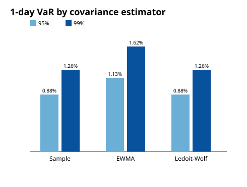

# Risk Management Engine

A multi-asset **portfolio risk management system** in modern C++ (C++20) — the
kind of engine a bank or hedge-fund risk desk runs next to its trading system.
Feed it daily returns and a portfolio definition; it produces Value at Risk (three
ways), Expected Shortfall, stress-test P&L, a correlation matrix, and a full
risk attribution, as both a machine-readable `report.json` and a human-readable
`report.md` with figures.

```
┌─────────────┐   ┌──────────────┐   ┌──────────────┐   ┌──────────────────────┐
│ returns CSV │──▶│ ReturnSeries │──▶│  Covariance  │──▶│ VaR / CVaR / Stress  │
│ portfolio   │   │   loader     │   │ (3 methods)  │   │ Attribution / Report │
│   JSON      │   └──────────────┘   └──────────────┘   └──────────────────────┘
└─────────────┘                                              │ report.json
                                                             │ report.md + SVGs
                                                             ▼
```

---

## Build & run

Dependencies (Eigen 3.4, nlohmann/json, Catch2) are vendored automatically via
CMake `FetchContent` — nothing to install.

```bash
cmake -S . -B build
cmake --build build -j
ctest --test-dir build --output-on-failure          # 54 tests

# Generate sample data (one-time; fixed seed, reproducible)
python3 scripts/generate_sample_data.py

# Run the engine
./build/compute_risk --portfolio config/portfolio.json \
                     --data data/returns/ --output output/
```

This writes `output/report.json`, `output/report.md`, and **seven SVG figures**
to `output/figures/`. A committed copy of a worked example — the full
[`report.md`](reports/sample_report.md), [`report.json`](reports/sample_report.json),
and figures — lives in [`reports/`](reports/).

---

## Worked example — main findings

The shipped example is a **diversified 13-instrument book across four asset
classes** — equities (SPY, QQQ, EFA, AAPL, MSFT, JPM, XOM), rates (TLT, IEF),
credit (LQD, HYG) and commodities (GLD, USO) — $25M notional, on **5 years of
daily data (1,260 observations)** generated from a realistic linear factor
model. Using a richer universe lets the report *compare instruments and methods
against one another*, which is where the interesting findings live.

> Headline: this book holds 13 names but the equity bucket still drives most of
> the risk — though far less extremely than a naive 60/30/10 would. The
> attribution, comparison tables, and figures below show exactly where risk
> hides and how much your *modelling choices* move the answer.

### 1. The instruments are not equally risky


**How to read it:** annualized volatility of every holding, sorted, coloured by
sector. **What it tells you:** vols span **7% (LQD investment-grade credit) to
32% (USO oil)** — a 4.5× range. Credit and intermediate Treasuries (IEF) are the
calmest; single-name equities (XOM, JPM, AAPL) and oil are the wildest. Position
*size* alone tells you nothing about risk until you weight by these.

### 2. Capital weight ≠ risk share


**How to read it:** for each holding, grey = share of capital, red = share of
portfolio risk. **What it tells you:** the equities (SPY, QQQ, AAPL, MSFT) all
show **red ≫ grey** — they punch above their weight. The bonds and gold show
**red ≪ grey**: e.g. **IEF is 12% of capital but only 3% of risk**, because it's
low-vol *and* lowly correlated to the book. This single chart is the case for
risk-based (not capital-based) position limits.

### 3. Risk contribution by position


**How to read it:** each bar is a position's share of *total* portfolio
volatility (`wᵢ·(Σw)ᵢ/σₚ`); bars sum to 100%. **What it tells you:** **SPY is the
top contributor at ~22%**, and the effective number of bets (`1/Σpctᵢ²`) is
**8.1** — across 13 holdings the book behaves like ~8 independent bets. That's
genuinely diversified (a single-asset book would score 1.0), but the equity
cluster still dominates the top of the list.

### 4. Why — the correlation structure


**How to read it:** red = positive, blue = negative, white ≈ 0; diagonal is 1.
**What it tells you:** clear blocks emerge — the **equity cluster** is tightly
linked (SPY/EFA **+0.85**, SPY/QQQ **+0.79**); the **rates/credit cluster** too
(TLT/IEF **+0.94**, TLT/LQD **+0.76**); and crucially **equities vs. Treasuries
are negative** (SPY/TLT **−0.11**), the stock-bond hedge. HYG sits *between* the
blocks (+0.43 to SPY, +0.33 to LQD) — high yield is half credit, half equity.
This block structure is exactly why the bonds dilute risk in chart #2.

### 5. The shape of the loss tail


**How to read it:** distribution of daily portfolio returns; dashed lines mark
the **95% VaR** and **95% CVaR** at returns `−VaR` and `−CVaR`. VaR is the
*threshold* of the worst 5% of days; CVaR is the *average* loss beyond it, so it
always sits deeper in the tail.

### 6. VaR & CVaR — the numbers

Portfolio volatility: **0.56% daily / 8.89% annual** (vs. ~10% for the naive
3-asset book — diversification at work).

| Method | Conf | Horizon | VaR | VaR ($) | CVaR | CVaR ($) |
|---|---:|---:|---:|---:|---:|---:|
| Historical | 95% | 1d | 0.86% | 213,968 | 1.18% | 294,012 |
| Parametric | 95% | 1d | 0.88% | 220,084 | 1.11% | 278,615 |
| MonteCarlo | 95% | 1d | 0.87% | 218,240 | 1.11% | 277,815 |
| **Historical** | **99%** | **1d** | **1.39%** | **348,418** | **1.66%** | **414,073** |
| Parametric | 99% | 1d | 1.26% | 315,543 | 1.45% | 363,011 |
| MonteCarlo | 99% | 1d | 1.26% | 314,466 | 1.45% | 363,386 |

**The key finding:** at 99% the **historical VaR (1.39%) exceeds the parametric
(1.26%)** — the factor model produces fat tails the Gaussian methods miss. This
is the textbook "parametric underestimates the tail" result, now visible on the
real example, not just in a unit test.

### 7. Model risk — the estimator you pick moves the number



**How to read it:** the *same* portfolio, priced with three covariance
estimators. **What it tells you:** the 95% VaR ranges **0.88% → 1.13%** — a **29%
spread purely from the estimation choice**. EWMA reads highest because it
overweights recent (more volatile) observations; Sample and Ledoit-Wolf agree.
This is *model risk* made concrete: the headline VaR is only as trustworthy as
the `Σ` behind it.

### 8. Backtest — is the VaR even calibrated?


**How to read it:** daily returns over the full 5 years against the 95% VaR line;
red marks are breaches. **What it tells you:** **63 breaches in 1,260 days = 5.0%**,
exactly the expected rate — the historical VaR is well-calibrated in-sample.
Far more breaches would mean the VaR is too optimistic; this is the first thing a
risk manager checks before trusting a number.

### 9. Stress tests — what a regime, not a day, would do

| Scenario | P&L | P&L ($) |
|---|---:|---:|
| 2008 GFC | −16.9% | −4,230,000 |
| **2020 COVID Crash** | **−19.2%** | **−4,797,500** |
| 1987 Black Monday | −9.9% | −2,483,750 |
| Equity −20% (factor) | −10.7% | −2,675,000 |
| Credit Spreads +200bps | −1.2% | −294,000 |
| USD +10% | −2.1% | −527,500 |

**What it tells you:** routine daily 99% VaR is ~$350k; the worst stress scenario
(**COVID, −$4.8M**) is roughly **14× larger**. VaR and stress answer different
questions (probabilistic-routine vs. deterministic-extreme); a risk report needs
both. The diversification that tames daily VaR does *not* save you in a broad
crisis, because that's exactly when the equity correlations all go to 1 and the
bond/gold hedge is too small to offset a 50%-equity book.

*(All numbers above are reproduced verbatim in
[`reports/sample_report.md`](reports/sample_report.md); the engine also emits the
machine-readable [`reports/sample_report.json`](reports/sample_report.json).)*

---

## Concepts

### What is Value at Risk?

VaR answers: *"Over the next N days, with confidence α, what is the most I expect
to lose?"* A 1-day 95% VaR of 0.86% means **on 95% of days the loss won't exceed
0.86% of the book; on the worst 5% it will be at least that.** It's a single,
comparable number across desks — which is why regulators and risk committees
live on it. Its weakness: it says nothing about *how bad* the worst 5% gets.
That's what **CVaR / Expected Shortfall** (the tail average) adds, and why Basel
FRTB moved to ES.

### Why three methods?

Each VaR method makes a different trade-off, and disagreement between them is
informative:

| Method | How | Best when | Weakness |
|--------|-----|-----------|----------|
| **Parametric (Gaussian)** | `z_α·σ·√h − μ·h`, closed form | you need speed and returns are ~normal | underestimates fat tails |
| **Historical** | empirical quantile of actual returns | returns are non-normal / skewed | only as rich as your history |
| **Monte Carlo** | simulate from `N(μ, Σ)` via Cholesky | non-linear / path-dependent books | slowest; model-dependent |

In the worked example MC and parametric coincide almost exactly — a linear
portfolio of multivariate-normal draws *is* univariate normal, so they agree by
construction — but at 99% the **historical VaR pulls ahead of both** (1.39% vs
1.26%) because the real return distribution has fatter tails than the Gaussian
assumes. That is the "parametric underestimates the tail" effect, visible right
in [section 6](#6-var--cvar--the-numbers) and reproduced under controlled
Student-t data in [`tests/test_var.cpp`](tests/test_var.cpp). Monte Carlo's
*own* value-add appears only with non-linear instruments (options) — which this
engine deliberately excludes (see below) — so here it tracks the parametric
number.

### Covariance estimators

Risk is driven by `Σ`, and estimating it well matters more than the VaR formula:

- **Sample** — unbiased `XᵀX/(n−1)`; the textbook default, noisy for short
  histories.
- **EWMA** (RiskMetrics, λ=0.94) — exponentially weights recent observations
  more, so the estimate adapts to changing volatility regimes.
- **Ledoit-Wolf shrinkage** — pulls the noisy sample matrix toward a
  constant-correlation target by an optimally-estimated intensity, improving
  conditioning (and out-of-sample portfolio risk). This is the example's
  default.

All three are cross-checked against numpy/reference implementations and every
returned matrix is asserted symmetric + positive-semi-definite.

### Risk attribution & concentration

Because component contributions **sum exactly to portfolio volatility**, risk is
fully additive across positions and sectors. The engine reports marginal,
component, and percentage contributions per position, a sector roll-up, and
concentration metrics (Herfindahl, effective number of bets, top contributor).

---

## Repository layout

```
risk-engine/
├── CMakeLists.txt
├── config/
│   ├── portfolio.json          # weights, notional, methods, sectors
│   ├── stress_scenarios.json   # historical + synthetic scenarios
│   └── factor_betas.json       # asset factor sensitivities
├── data/returns/*.csv          # daily price series (date,price)
├── include/risk/*.hpp          # public headers
├── src/*.cpp                   # implementations
├── tests/test_*.cpp            # 54 Catch2 tests
├── apps/compute_risk.cpp       # CLI
├── scripts/                    # numpy cross-check + data generator
└── reports/                    # committed worked-example + figures
```

| Module | Responsibility |
|--------|----------------|
| `return_series` | CSV → returns; missing-data policy; annualization |
| `covariance` | Sample / EWMA / Ledoit-Wolf; PSD checks; correlation |
| `portfolio` | `wᵀΣw`, marginal & component risk |
| `var` / `cvar` | three VaR methods + Expected Shortfall |
| `stress_test` | scenario P&L (asset shocks + factor betas) |
| `attribution` | risk contributions + concentration |
| `figures` | self-contained SVG charts (no plotting dependency) |
| `reporter` | assemble + emit `report.json` / `report.md` |

---

## Numerical safety

This project treats silent numerical errors as bugs:

- Every covariance/correlation matrix returned by a public function passes a
  **symmetry + PSD assert** in debug builds (`assert(is_psd(M))`).
- Missing data has an **explicit policy** (skip vs fill-forward) — never a silent
  default.
- Every **annualization / horizon factor is documented at its call site**
  (252 for equities; √-time for VaR scaling).
- Percentile computations use **`std::nth_element`, not a full sort**.
- Numerical routines are tested against **analytically-known values**, not just
  self-consistency (numpy cross-checks, closed-form Gaussian ES, hand-computed
  attribution).

---

## What's NOT in here

- **No derivatives Greeks-based (delta-gamma) VaR** — that belongs to a rates /
  options engine. This book is treated as linear.
- **No liquidity-adjusted VaR** (no bid/ask or market-impact haircut).
- **No model-risk treatment** (single covariance estimate per run; no parameter
  uncertainty bands).

---

## References

- Philippe Jorion, *Value at Risk: The New Benchmark for Managing Financial
  Risk*, 3rd ed.
- J.P. Morgan/Reuters, *RiskMetrics — Technical Document* (1996) — EWMA, √-time.
- Ledoit & Wolf, *Honey, I Shrunk the Sample Covariance Matrix*, J. Portfolio
  Management (2004).
- Basel Committee, *Minimum Capital Requirements for Market Risk* (FRTB) — the
  VaR → Expected Shortfall shift.
