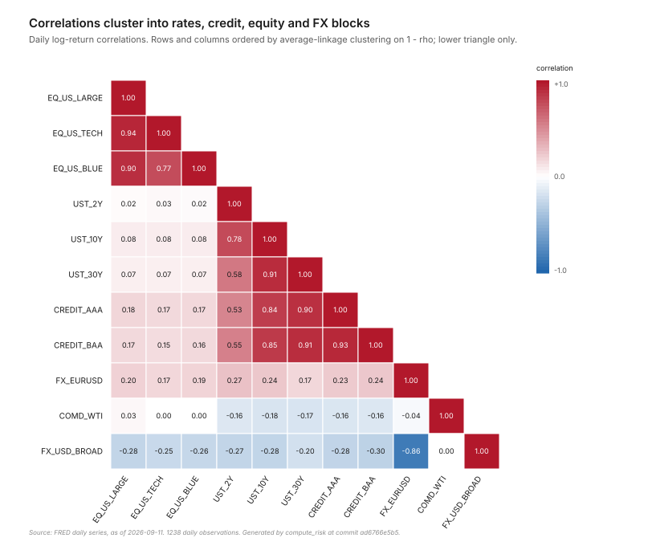
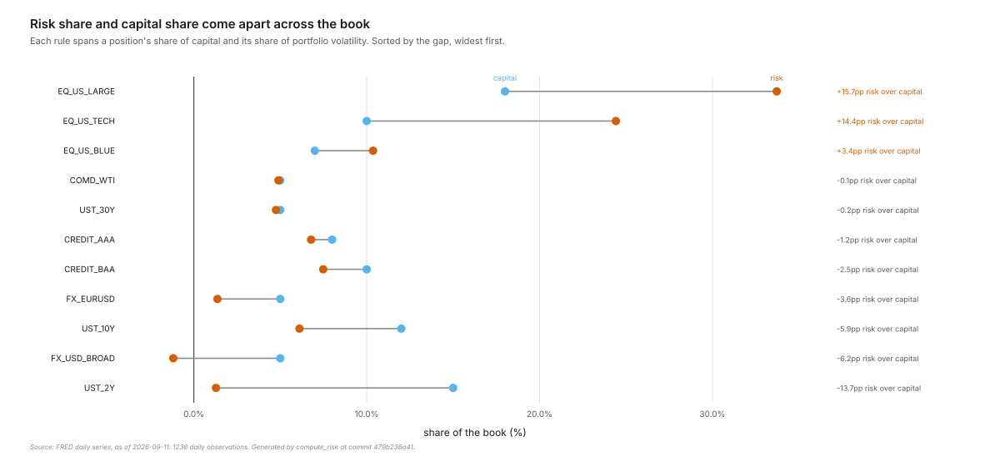
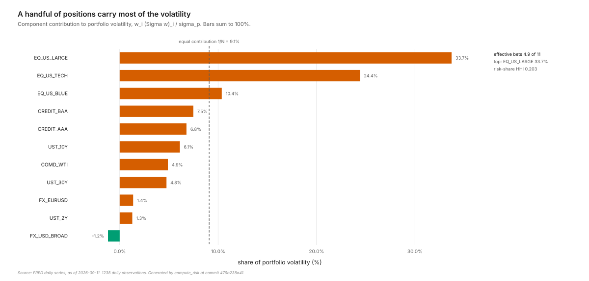
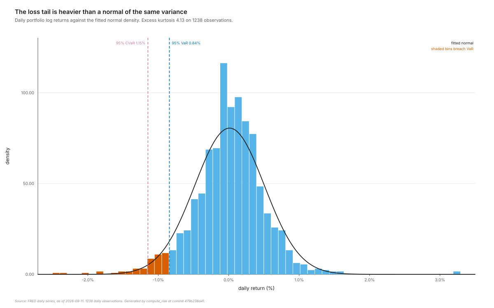
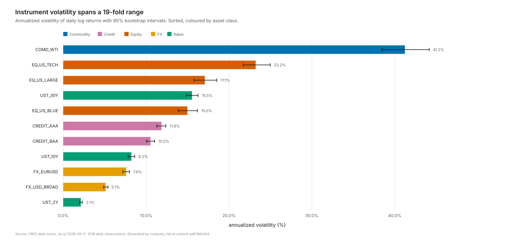
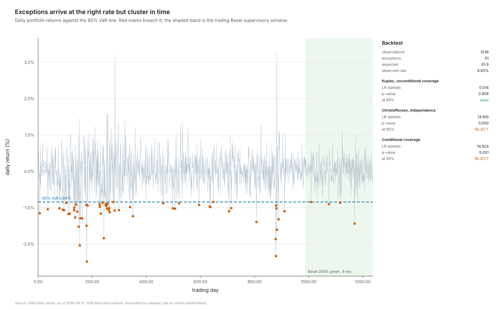
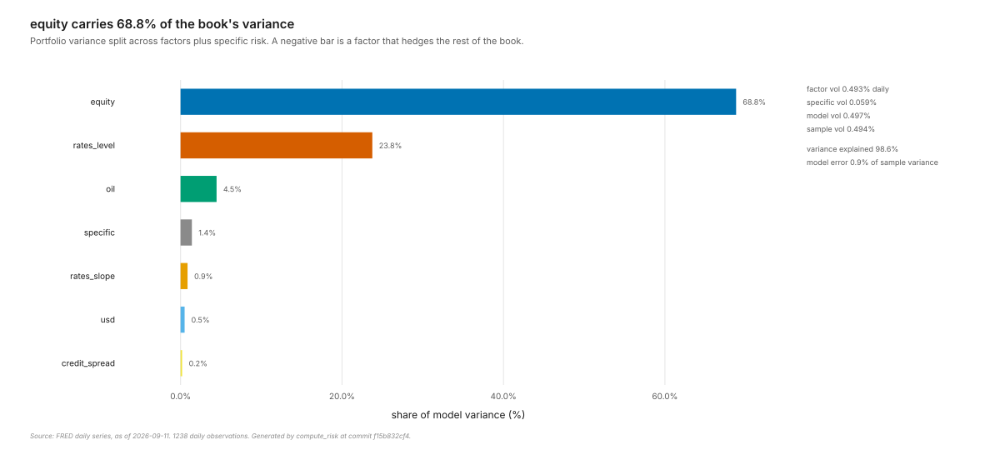
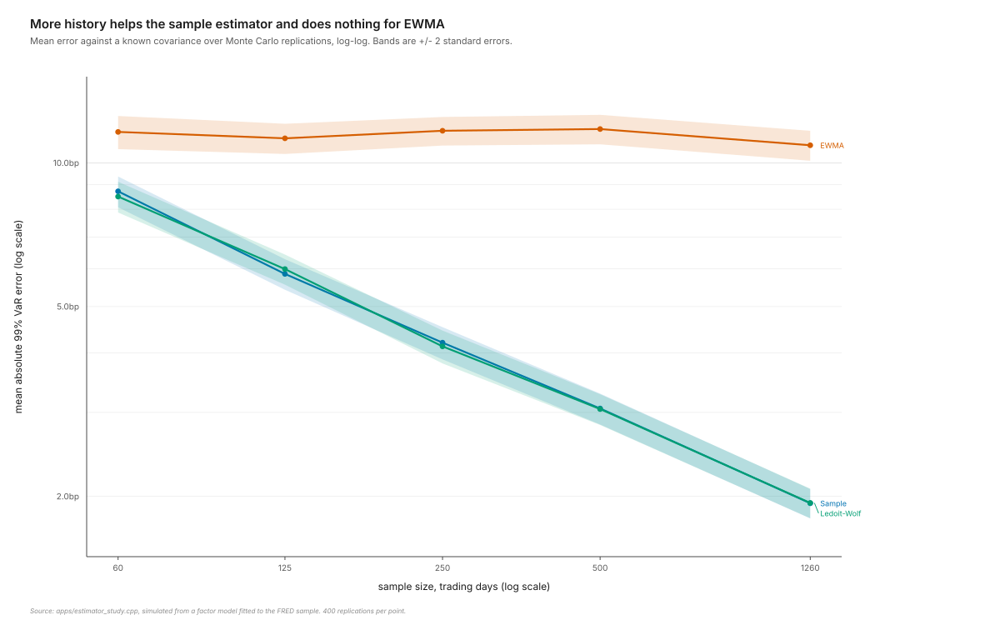
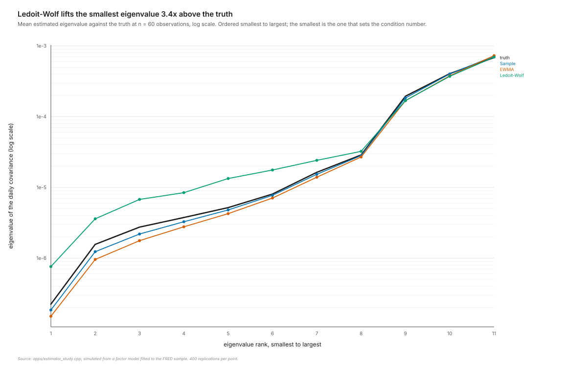

# Risk report: Multi-Asset Book

| | |
|---|---|
| Data as-of | 2026-09-11 |
| Code commit | ad6766e5b5 |
| Seed | 42 |
| Notional | $25,000,000 |
| Covariance estimator | ledoit_wolf |
| Observations | 1238 |
| Portfolio volatility | 0.49% daily / 7.85% annual |
| Return skewness | 0.02 |
| Return excess kurtosis | 4.13 |
| cond(Sigma) | 1669.3 |
| cond(correlation) | 189.4 |

## Value at Risk and Expected Shortfall

| Method | Conf | Horizon | VaR | VaR ($) | CVaR | CVaR ($) |
|---|---:|---:|---:|---:|---:|---:|
| Historical | 95% | 1d | 0.84% | $210,418 | 1.15% | $286,543 |
| Parametric | 95% | 1d | 0.80% | $200,238 | 1.01% | $251,885 |
| MonteCarlo | 95% | 1d | 0.80% | $200,618 | 1.01% | $251,488 |
| Historical | 95% | 10d | 2.66% | $665,401 | 3.62% | $906,127 |
| Parametric | 95% | 10d | 2.45% | $612,277 | 3.10% | $775,597 |
| MonteCarlo | 95% | 10d | 2.45% | $611,521 | 3.10% | $775,561 |
| Historical | 99% | 1d | 1.29% | $322,077 | 1.72% | $429,367 |
| Parametric | 99% | 1d | 1.14% | $284,469 | 1.31% | $326,353 |
| MonteCarlo | 99% | 1d | 1.13% | $282,922 | 1.29% | $323,281 |
| Historical | 99% | 10d | 4.07% | $1,018,497 | 5.43% | $1,357,777 |
| Parametric | 99% | 10d | 3.51% | $878,639 | 4.04% | $1,011,085 |
| MonteCarlo | 99% | 10d | 3.51% | $878,727 | 4.05% | $1,012,624 |

## Backtests

Kupiec tests whether exceptions arrived at the advertised rate. Christoffersen tests whether they clustered, which is the failure mode that actually costs money. Basel reads the exception count over the trailing 250 sessions against the supervisory table. Acerbi-Szekely Z2 tests Expected Shortfall, which cannot be backtested by counting hits because it is not elicitable; a negative Z means realised tail losses were worse than the model said.

| Method | Conf | VaR | Exc. | Exp. | Kupiec p | Christ. p | Cond. cov. p | Basel | AS Z2 | Z2 p |
|---|---:|---:|---:|---:|---|---|---|---|---:|---:|
| Historical | 95% | 0.84% | 61 | 61.9 | 0.906 pass | 0.000 REJECT | 0.001 REJECT | green (4/250) | 0.015 | 0.021 |
| Parametric | 95% | 0.80% | 66 | 61.9 | 0.597 pass | 0.001 REJECT | 0.002 REJECT | green (5/250) | -0.187 | 0.069 |
| MonteCarlo | 95% | 0.80% | 66 | 61.9 | 0.597 pass | 0.001 REJECT | 0.002 REJECT | green (5/250) | -0.189 | 0.065 |
| Historical | 99% | 1.29% | 12 | 12.4 | 0.913 pass | 0.004 REJECT | 0.016 REJECT | green (1/250) | 0.031 | 0.000 |
| Parametric | 99% | 1.14% | 19 | 12.4 | 0.080 pass | 0.032 REJECT | 0.021 REJECT | green (1/250) | -0.797 | 0.005 |
| MonteCarlo | 99% | 1.13% | 19 | 12.4 | 0.080 pass | 0.032 REJECT | 0.021 REJECT | green (1/250) | -0.814 | 0.006 |

## Instruments

| Asset | Class | Weight | Ann. vol | 95% CI | Ann. return | Sharpe | Skew | Ex. kurt | Corr to book | % of risk |
|---|---|---:|---:|---:|---:|---:|---:|---:|---:|---:|
| EQ_US_LARGE | Equity | 18.0% | 17.08% | [15.8%, 18.5%] | 11.13% | 0.65 | 0.03 | 6.26 | 0.86 | 33.7% |
| EQ_US_TECH | Equity | 10.0% | 23.22% | [21.7%, 25.0%] | 13.23% | 0.57 | 0.04 | 4.06 | 0.83 | 24.4% |
| EQ_US_BLUE | Equity | 7.0% | 14.97% | [13.9%, 16.2%] | 8.52% | 0.57 | 0.06 | 5.32 | 0.78 | 10.4% |
| UST_2Y | Rates | 15.0% | 2.12% | [2.0%, 2.3%] | 1.96% | 0.92 | 0.62 | 5.80 | 0.32 | 1.3% |
| UST_10Y | Rates | 12.0% | 8.22% | [7.8%, 8.6%] | -2.61% | -0.32 | 0.10 | 0.93 | 0.49 | 6.1% |
| UST_30Y | Rates | 5.0% | 15.54% | [14.9%, 16.3%] | -9.20% | -0.59 | 0.00 | 0.74 | 0.48 | 4.8% |
| CREDIT_AAA | Credit | 8.0% | 11.85% | [11.3%, 12.4%] | -5.22% | -0.44 | -0.03 | 0.96 | 0.56 | 6.8% |
| CREDIT_BAA | Credit | 10.0% | 10.53% | [10.1%, 11.0%] | -3.15% | -0.30 | 0.01 | 0.80 | 0.56 | 7.5% |
| COMD_WTI | Commodity | 5.0% | 41.23% | [38.5%, 44.2%] | 6.92% | 0.17 | -0.62 | 4.04 | 0.18 | 4.9% |
| FX_USD_BROAD | FX | 5.0% | 5.12% | [4.9%, 5.4%] | 0.81% | 0.16 | -0.19 | 1.31 | -0.37 | -1.2% |
| FX_EURUSD | FX | 5.0% | 7.59% | [7.2%, 8.0%] | -0.23% | -0.03 | 0.21 | 1.47 | 0.28 | 1.4% |

## Covariance estimators

The same book under three estimators. The spread in the VaR columns is model risk; the condition numbers are why shrinkage exists.

| Estimator | Daily vol | Annual vol | 95% VaR | 99% VaR | cond(Sigma) | cond(corr) | delta* |
|---|---:|---:|---:|---:|---:|---:|---:|
| Sample | 0.50% | 7.86% | 0.80% | 1.14% | 2141.2 | 378.2 | - |
| EWMA | 0.28% | 4.39% | 0.44% | 0.63% | 12465.6 | 399.3 | - |
| Ledoit-Wolf | 0.49% | 7.85% | 0.80% | 1.14% | 1669.3 | 189.4 | 0.0148 |

## Volatility attribution

| Asset | Weight | Marginal | Component | % of risk |
|---|---:|---:|---:|---:|
| EQ_US_LARGE | 18.0% | 0.0093 | 0.0017 | 33.7% |
| EQ_US_TECH | 10.0% | 0.0121 | 0.0012 | 24.4% |
| EQ_US_BLUE | 7.0% | 0.0073 | 0.0005 | 10.4% |
| UST_2Y | 15.0% | 0.0004 | 0.0001 | 1.3% |
| UST_10Y | 12.0% | 0.0025 | 0.0003 | 6.1% |
| UST_30Y | 5.0% | 0.0047 | 0.0002 | 4.8% |
| CREDIT_AAA | 8.0% | 0.0042 | 0.0003 | 6.8% |
| CREDIT_BAA | 10.0% | 0.0037 | 0.0004 | 7.5% |
| COMD_WTI | 5.0% | 0.0048 | 0.0002 | 4.9% |
| FX_USD_BROAD | 5.0% | -0.0012 | -0.0001 | -1.2% |
| FX_EURUSD | 5.0% | 0.0014 | 0.0001 | 1.4% |
| **Total** |  |  | **0.0049** | **100.0%** |

| Asset class | % of risk |
|---|---:|
| Commodity | 4.9% |
| Credit | 14.3% |
| Equity | 68.5% |
| FX | 0.2% |
| Rates | 12.2% |

Effective number of bets 4.92 across 11 holdings; largest contributor EQ_US_LARGE at 33.7%.

## VaR decomposition at 95%

Component VaR sums to total VaR exactly, by Euler's theorem. The residual is printed so the identity is checked rather than assumed.

| Asset | Marginal VaR | Component VaR | Component ($) | % of VaR |
|---|---:|---:|---:|---:|
| EQ_US_LARGE | 0.0148 | 0.0027 | $66,566 | 33.2% |
| EQ_US_TECH | 0.0193 | 0.0019 | $48,327 | 24.1% |
| EQ_US_BLUE | 0.0117 | 0.0008 | $20,489 | 10.2% |
| UST_2Y | 0.0006 | 0.0001 | $2,313 | 1.2% |
| UST_10Y | 0.0042 | 0.0005 | $12,741 | 6.4% |
| UST_30Y | 0.0081 | 0.0004 | $10,124 | 5.1% |
| CREDIT_AAA | 0.0071 | 0.0006 | $14,206 | 7.1% |
| CREDIT_BAA | 0.0062 | 0.0006 | $15,527 | 7.8% |
| COMD_WTI | 0.0077 | 0.0004 | $9,609 | 4.8% |
| FX_USD_BROAD | -0.0020 | -0.0001 | -$2,457 | -1.2% |
| FX_EURUSD | 0.0022 | 0.0001 | $2,793 | 1.4% |
| **Total** |  | **0.0080** | **$200,238** | **100.0%** |

Euler residual: -0.000000000000000002

## VaR decomposition at 99%

Component VaR sums to total VaR exactly, by Euler's theorem. The residual is printed so the identity is checked rather than assumed.

| Asset | Marginal VaR | Component VaR | Component ($) | % of VaR |
|---|---:|---:|---:|---:|
| EQ_US_LARGE | 0.0211 | 0.0038 | $94,969 | 33.4% |
| EQ_US_TECH | 0.0276 | 0.0028 | $68,893 | 24.2% |
| EQ_US_BLUE | 0.0167 | 0.0012 | $29,224 | 10.3% |
| UST_2Y | 0.0009 | 0.0001 | $3,392 | 1.2% |
| UST_10Y | 0.0060 | 0.0007 | $17,891 | 6.3% |
| UST_30Y | 0.0113 | 0.0006 | $14,129 | 5.0% |
| CREDIT_AAA | 0.0100 | 0.0008 | $19,921 | 7.0% |
| CREDIT_BAA | 0.0087 | 0.0009 | $21,832 | 7.7% |
| COMD_WTI | 0.0110 | 0.0005 | $13,732 | 4.8% |
| FX_USD_BROAD | -0.0028 | -0.0001 | -$3,458 | -1.2% |
| FX_EURUSD | 0.0032 | 0.0002 | $3,945 | 1.4% |
| **Total** |  | **0.0114** | **$284,469** | **100.0%** |

Euler residual: -0.000000000000000002

## Incremental VaR on a hypothetical trade

Full revaluation at 99% over one day, against the marginal-VaR linearisation a desk would do in its head.

| Trade | VaR before | VaR after | Incremental | Linear estimate | Linearisation error |
|---|---:|---:|---:|---:|---:|
| +$1,000,000 EQ_US_LARGE | $284,469 | $305,836 | $21,366 | $21,104 | -$262 |
| +$1,000,000 FX_EURUSD | $284,469 | $287,821 | $3,352 | $3,156 | -$195 |
| -$1,000,000 EQ_US_LARGE | $284,469 | $263,670 | -$20,800 | -$21,104 | -$305 |

## Factor risk decomposition

| Factor | Exposure | Variance contribution | % of model variance |
|---|---:|---:|---:|
| equity | 0.3688 | 0.0000169713 | 68.8% |
| rates_level | -4.4469 | 0.0000058581 | 23.8% |
| rates_slope | -0.8455 | 0.0000002138 | 0.9% |
| credit_spread | -1.4131 | 0.0000000483 | 0.2% |
| usd | -0.0207 | 0.0000001237 | 0.5% |
| oil | 0.0472 | 0.0000011000 | 4.5% |
| specific |  | 0.0000003461 | 1.4% |
| **total** |  | **0.0000246612** | **100.0%** |

Factor model volatility 0.497% daily against a sample volatility of 0.494%. The gap, 0.9% of sample variance, is what the factor model does not capture.

## Stress tests

| Scenario | P&L | P&L ($) |
|---|---:|---:|
| 1987 Black Monday | -4.60% | -$1,150,138 |
| 1998 Russia / LTCM | -6.06% | -$1,514,686 |
| 2008 Lehman | -24.32% | -$6,080,066 |
| 2020 COVID crash | -16.91% | -$4,227,502 |
| 2022 rates repricing | -25.60% | -$6,400,225 |
| 2023 SVB | 0.41% | $103,393 |
| Hypothetical: equity -20% | -8.23% | -$2,057,462 |
| Hypothetical: rates +100bp parallel | -4.45% | -$1,111,736 |
| Hypothetical: credit +200bp | -2.83% | -$706,538 |

## Reverse stress

The most likely factor move reaching each loss, found by minimising Mahalanobis distance subject to the loss constraint. The distance column is the answer: how many standard deviations of the book's own one-day factor distribution the scenario sits at.

These are single-session moves. The Gaussian probability is what a normal factor distribution would assign to a move that large, and for the deeper rows it is not a forecast: the book's measured excess kurtosis of 4.13 means the real tail is far heavier than the normal it is computed under. Read the distance, not the probability.

| Target loss | Target ($) | Distance (daily sigma) | Gaussian prob. | Implied factor move |
|---:|---:|---:|---:|---|
| 5.0% | $1,250,000 | 10.14 | 0.00000000 | equity -9.46%, rates_level +27bp, rates_slope +5bp, credit_spread +1bp, usd +1.23%, oil -4.79% |
| 10.0% | $2,500,000 | 20.28 | 0.00000000 | equity -18.92%, rates_level +54bp, rates_slope +10bp, credit_spread +1bp, usd +2.46%, oil -9.59% |
| 20.0% | $5,000,000 | 40.56 | 0.00000000 | equity -37.85%, rates_level +108bp, rates_slope +21bp, credit_spread +3bp, usd +4.92%, oil -19.18% |

## Figures

**Correlation matrix, reordered by hierarchical clustering.**

**Capital share against risk share, sorted by the gap.**

**Component contribution to portfolio volatility.**

**Return distribution against the fitted normal, with VaR and CVaR.**

**Annualized volatility per instrument with bootstrap intervals.**

**VaR exceptions with Kupiec, Christoffersen and Basel results.**

**Variance split across factors and specific risk.**

**Estimator error against a known covariance, by sample size.**

**Estimated eigenvalue spectrum against the true one.**

